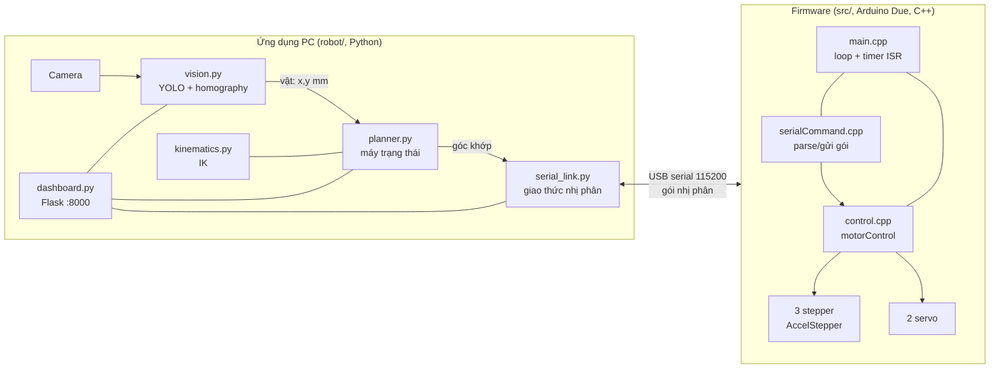
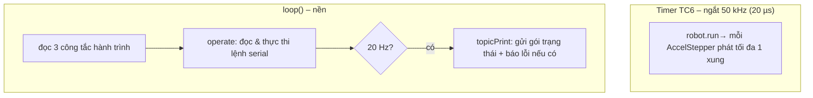
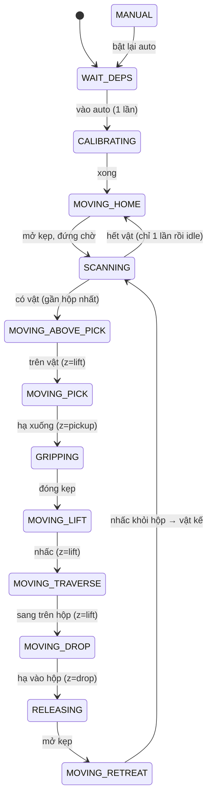

# Báo cáo lập trình – Cánh tay robot phân loại

Tài liệu này mô tả **kiến trúc phần mềm** và **luồng logic hoạt động** của cả hai
nửa hệ thống: firmware trên vi điều khiển (`src/`, `include/`) và ứng dụng PC
(`robot/`). Dành cho người tiếp nhận, bảo trì hoặc phát triển tiếp mã nguồn.

---

## 1. Tổng quan kiến trúc

Hệ thống chia làm 2 nửa, giao tiếp qua **USB serial bằng giao thức nhị phân cố định
kích thước** ("machine interface"):

**Phân chia trách nhiệm:** PC lo "trí tuệ" (thị giác, IK, lập lịch, giao diện); MCU
lo "cơ bắp" thời gian thực (phát xung động cơ, giới hạn an toàn, hiệu chuẩn). Ranh
giới giữa hai bên chỉ là giao thức gói tin ở mục 2.

> Ghi chú lịch sử: nửa PC trước đây là stack **ROS2 + Docker** (còn trong `ros2/`,
> đã ngừng dùng). Nay thay bằng `robot/` chạy thẳng trên Windows/Linux. Giao thức
> serial và toán IK giữ nguyên từ thời ROS2.

---

## 2. Giao thức giao tiếp PC ↔ MCU

Nhị phân, cố định kích thước, có **checksum XOR**. Chỉ một lệnh "bay" tại một thời
điểm (single‑flight).

**PC → MCU** (`serialPackage`): `[0xAA, commandID(char), bitmask(byte), 5×float, checksum]`
- `bitmask`: 5 bit chọn khớp áp dụng (bit i ↔ trục a..e = khớp 1,2,3,4,kẹp).

**MCU → PC** (`sendPackage`, phát ~20 Hz): `[0xFE, processingID(char), statusID(char), 5×float, limitSwitches(byte), checksum]`
- `processingID`: lệnh đang xử lý; `statusID`: `P` (đang chạy), `D` (xong), `F` (lỗi).
- `limitSwitches`: bitmask 3 công tắc A/B/C (bit0/1/2), cực tính thô: 1 = hở/không
  chạm, 0 = đang tì vào công tắc.

**Bảng lệnh (commandID):**

| ID | Lệnh | Ý nghĩa |
|----|------|---------|
| `M` | move | Di chuyển **tương đối** các khớp trong bitmask. |
| `A` | moveto | Di chuyển **tuyệt đối**; khớp 1‑3 **đồng bộ thời gian** (movetoSync); servo di chuyển ngay. |
| `P` | position | Báo cáo góc hiện tại. |
| `C` | currentPos | Đặt góc hiện tại (không di chuyển). |
| `G` / `R` | grip / release | Đóng / mở kẹp. |
| `F` | moveref | Hiệu chuẩn về công tắc gốc. |
| `X` | abort | Dừng khẩn (**chưa hoàn thiện** trong firmware). |

Chi tiết struct và bảng lỗi: xem `README.md`.

---

## 3. Firmware (`src/`, `include/`) — Arduino Due

### 3.1 Phần cứng & cấu hình (`include/config.h`)
- MCU **Arduino Due** (ARM Cortex‑M3, 84 MHz, **không có FPU** → toán `float` chạy
  phần mềm, chậm).
- 3 động cơ bước qua driver **TB6600** (chân dir/pul), 2 **servo** (khớp 4, kẹp).
- Thông số: `GEAR_RATIO 13.7`, `STEP_PER_REV 200`, `MICRO_STEP 8` → **21 920
  bước/vòng khớp**. `maxSpeed = 43 840 bước/s`, `acceleration = 1200 bước/s²`.
- Giới hạn khớp (theo **bước**, không phải độ) và giới hạn chống va chạm
  `joint2 + joint3 < 55°`.

### 3.2 Vòng đời chương trình (`src/main.cpp`)
Hai "nhịp" chạy song song:

- **Timer TC6 ở 50 kHz** gọi `robot.run()`: đây là nơi **thực sự phát xung** động
  cơ. Vì mỗi lần gọi phát tối đa 1 xung/khớp → **trần tốc độ ~50 000 bước/s/khớp**.
  ISR này bị hạ ưu tiên dưới ngắt của Servo để xung servo không bị "đói".
- **`operate()`** đọc 1 lệnh, đặt mục tiêu cho động cơ (relative/absolute/servo…),
  hoặc chạy hiệu chuẩn. Với `A` (moveto) gom khớp 1‑3 rồi gọi `movetoSync`.
- **`topicPrint()`** phát gói trạng thái 20 Hz (góc hiện tại + công tắc + trạng thái
  lệnh).

### 3.3 Điều khiển động cơ (`src/control.cpp`, `motorControl`)
- **`run()`** – được ISR gọi liên tục: chỉ cho `joint.run()` khi **thỏa giới hạn
  khớp và chống va chạm**; nếu vi phạm thì dừng và đặt cờ lỗi.
- **`movetoSync(useAxis, targetDeg)`** – di chuyển **đồng bộ** khớp 1‑3: tính thời
  gian profile hình thang cho từng trục, **kéo giãn** tốc độ/gia tốc các trục nhanh
  (`V'=V/s`, `A'=A/s²`) để mọi trục **về đích cùng lúc**. ⚠️ Giả định **mọi trục
  xuất phát từ trạng thái nghỉ** — nếu phát lệnh khi trục còn đang chạy nhanh thì
  trục "ngắn" (gia tốc bị hạ) **phanh không kịp → vọt lố**. (Đây là gốc của bug đã
  xử lý ở phía PC, mục 5.)
- **`refCalibrate()`** – hiệu chuẩn 3 pha (mỗi pha timeout 10 s): (1) đưa khớp 2‑3
  về công tắc, (2) khớp 1 về công tắc, (3) về home. Đặt lại gốc tọa độ theo các
  góc tham chiếu. Kết thúc luôn gửi `F/D`.
- **Servo (khớp 4, kẹp)**: điều khiển hở (không phản hồi vị trí); `servoAngle()`
  chỉ đọc lại **xung đã lệnh**, không phải vị trí thật. Có macro
  `DETACH_SERVO_AFTER_TASK` tách servo sau mỗi lệnh để đỡ rung/giữ dòng.

### 3.4 Đặc tính tốc độ (kết luận)
`maxSpeed` (≈120 RPM khớp) đã sát trần ISR 50 kHz, nhưng **không phải nút thắt**:
vì `acceleration = 1200` thấp, mọi lệnh thực tế là **tam giác** — một cú xoay 90°
chỉ đạt đỉnh ~7 RPM khớp (~5% trần). **Muốn nhanh hơn phải tăng gia tốc**, không
phải tăng tốc độ đỉnh. (`JOINT_SPEEDDOWN` khai báo nhưng không dùng.)

---

## 4. Ứng dụng PC (`robot/`) — Python

### 4.1 Các module

| File | Vai trò |
|------|---------|
| `main.py` | Điểm vào: đọc config, tự dò MCU/camera, khởi tạo và ghép các thành phần, chạy các luồng. |
| `devices.py` | Tự dò cổng MCU (`2341:003D`) và chỉ số camera (`0C45:636B`) theo mã USB. |
| `serial_link.py` | `SerialLink`: giao thức nhị phân, luồng đọc riêng, hàng đợi single‑flight, các lệnh cấp cao. |
| `vision.py` | `VisionWorker`: camera + YOLO, đổi pixel→mm (homography), lọc ROI, phát ảnh chú thích. |
| `kinematics.py` | Nghịch động học `solve_ik_first(x,y,z)` → góc khớp (hoặc `None`). |
| `planner.py` | `Planner`: máy trạng thái pick‑and‑place. |
| `dashboard.py` | Web dashboard Flask (giám sát + điều khiển tay). |
| `tools/cli.py`, `tools/test_camera.py`, `camera_calibrate.py` | Công cụ dòng lệnh / hiệu chuẩn. |

### 4.2 Mô hình luồng (threads)
`main.py` chạy nhiều luồng song song, giao tiếp qua vùng dữ liệu có khóa:
- **Luồng đọc serial** (`serial_link`): liên tục ghép/kiểm checksum gói MCU→PC, cập
  nhật `current_joints`, `last_status`, `limit_switches`, gọi listener.
- **Luồng vision** (`VisionWorker`): đọc khung hình → YOLO → danh sách vật (mm) +
  ảnh JPEG chú thích.
- **Luồng planner** (`run_forever`): lặp máy trạng thái.
- **Luồng dashboard** (Flask): phục vụ web, đọc trạng thái + đẩy lệnh.

### 4.3 Thị giác (`vision.py`)
- Mở camera (DirectShow trên Windows, V4L2 trên Linux), chạy YOLO (`best.pt`, lớp
  Onion/Garlic/Lemon).
- **`pixel_to_robot`**: nhân **ma trận homography 3×3** (nạp từ
  `camera_calibration.yaml`) → tọa độ robot (mm). Lọc bỏ vật ngoài **ROI**.
- **Độc lập độ phân giải**: `set_frame_size` tự quy đổi homography + ROI khi khung
  hình khác độ phân giải hiệu chuẩn, theo mô hình camera **cắt giữa + thu phóng đều**
  (không kéo giãn theo trục) → đổi 1920×1080 ↔ 640×480 vẫn đúng vị trí.
- Cung cấp `get_detections()` (cho planner) và `get_frame_jpeg()` (cho dashboard).

### 4.4 Nghịch động học (`kinematics.py`)
`solve_ik(x,y,z)` giải hình học tay 4 bậc (độ dài khâu theo phần cứng), áp **offset
hiệu chuẩn** và **bộ lọc an toàn** (giới hạn từng khớp + chống va chạm
`q2+q3<60`), trả nghiệm hợp lệ đầu tiên; khớp 4 được dịch về hệ servo 0‑180°
(**không cộng thêm +90 ở nơi khác**). Ngoài tầm với → `None`.

### 4.5 Giao thức cấp cao (`serial_link.py`)
- `move_to(angles, bitmask)` – gửi `A`, rồi **chờ tới đích**: khớp phải **vừa trong
  dung sai VỪA đã dừng hẳn** (`_reached`: biến thiên giữa 2 mẫu ≤ `settle_eps`).
  Yêu cầu "dừng hẳn" là để lệnh kế tiếp xuất phát từ nghỉ, tránh `movetoSync` vọt
  lố (mục 5).
- `grip_close/open`, `calibrate`, `query_position`, `set_current_pos`, `abort`.
- Cơ chế ack: chỉ các lệnh có ack nguyên tử (`G/R/F/P`) mới khớp theo `processingID`;
  move/moveto không có ack tin cậy nên **poll** `current_joints` tới đích.

### 4.6 Bộ lập lịch (`planner.py`) — máy trạng thái
Chu trình **quỹ đạo chữ nhật liên tục**, ưu tiên vật **gần hộp nhất**, chỉ về home
khi hết vật:

- **Hiệu chuẩn đúng 1 lần mỗi khi vào auto**: cờ `_need_calibrate` bật khi khởi tạo
  và mỗi lần `auto_mode()` (kể cả Manual→Auto), **xóa khi calib thành công**; vòng
  gắp không bao giờ vào lại `CALIBRATING`.
- **Chọn vật gần hộp nhất** (`_nearest_to_box`): khoảng cách tới hộp đích của chính
  vật đó.
- **Chỉ về home khi trống**: cờ `_homed_idle` để `SCANNING` đứng yên ở home thay vì
  liên tục về home.
- Mỗi bước di chuyển qua `_move_to_xyz` (IK + move); lỗi/ngoài‑tầm‑với → `MOVING_HOME`
  để phục hồi an toàn.

### 4.7 Web dashboard (`dashboard.py`)
Flask, phục vụ trang tĩnh + API:

| Endpoint | Chức năng |
|----------|-----------|
| `GET /video` | Luồng MJPEG ảnh chú thích. |
| `GET /api/status` | Chế độ, việc đang làm, góc khớp, vật đang thấy, công tắc. |
| `GET /api/history` | Chuỗi góc khớp (biểu đồ). |
| `POST /api/mode` | Bật/tắt auto. |
| `POST /api/move`, `/api/goto` | Di chuyển tay (góc khớp / điểm XYZ qua IK). |
| `POST /api/grip`, `/api/release`, `/api/calibrate` | Lệnh tay. |

Lệnh tay bị chặn (409) khi đang ở AUTO — ở AUTO planner làm chủ cánh tay.

### 4.8 Nhật ký (logging) để gỡ lỗi
- `planner`: log **mọi chuyển trạng thái** (`state: A -> B`), **heartbeat** định kỳ
  (`[hb] task=… pos=…`), và mỗi lệnh di chuyển (`target=(x,y,z) ik=[…]`,
  `reached in Xs` hoặc `TIMEOUT … residual=[…]`).
- `serial_link`: trong lúc chờ move, log `move: waiting residual[…]` (~1 Hz) — thấy
  **trực tiếp** khớp nào đang kẹt/vọt lố khi luồng planner bị chặn.

---

## 5. Quyết định thiết kế & lỗi đã xử lý

- **Vọt lố khớp gốc khi nối segment (đã sửa).** Quỹ đạo chữ nhật phát lệnh liên
  tiếp; `move_to` cũ trả về ngay khi vào dung sai 2° trong khi động cơ **còn chạy
  nhanh**, vi phạm giả định "xuất phát từ nghỉ" của `movetoSync` → khớp gốc vọt lố
  ~16°, bò về chậm → timeout ("đơ"). **Sửa (PC):** `move_to` chờ **dừng hẳn**
  (`settle_eps`) mới trả về.
- **Hiệu chuẩn 2 lần (đã sửa).** `calibrate_timeout` (20 s) < worst‑case firmware
  (~31 s) khiến báo lỗi giả → retry calib. **Sửa:** tăng timeout lên 35 s + cờ
  `_need_calibrate` (đúng 1 lần/lần vào auto).
- **Sai vị trí khi đổi độ phân giải (đã sửa).** Homography hiệu chuẩn ở một độ phân
  giải; `set_frame_size` quy đổi theo mô hình cắt‑giữa + thu‑phóng‑đều.
- **Đồng bộ khớp 1‑3 (firmware `movetoSync`)** để các trục về đích cùng lúc, tránh
  giật khi một trục xong sớm.
- **Servo hở vòng**: không có phản hồi vị trí; "move done" của servo chỉ xác nhận đã
  phát lệnh. Kẹp hiện bị ghim 148° cho tới khi đo được góc mở/đóng thật
  (`doc/bug-report.md` 1.4).

Các lỗi đang theo dõi/chưa xử lý: xem [`doc/bug-report.md`](bug-report.md) và
[`TODO.md`](../TODO.md).

---

## 6. Cấu hình (`robot/config.yaml`)
Bốn khối: `serial` (cổng, timeout, `settle_eps_deg`), `vision` (camera, độ phân
giải, model, ngưỡng, file hiệu chuẩn), `dashboard` (host/port), `planner` (độ cao
nhấc/hạ, các hộp `zones`, home, bán kính vùng). Là nơi tinh chỉnh hành vi mà **không
cần sửa mã**.
